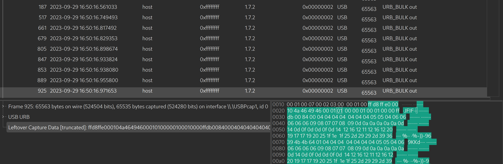
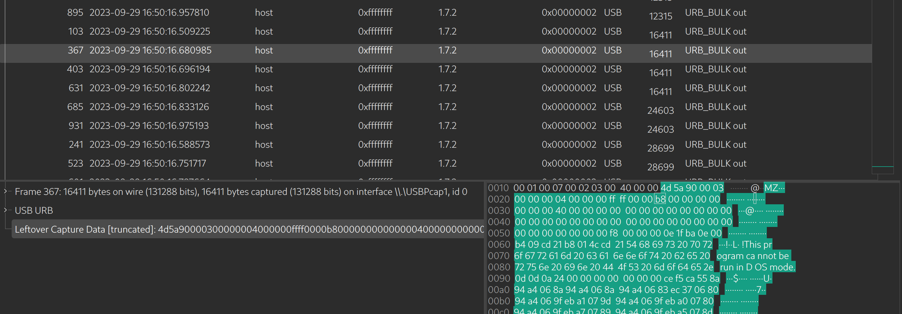

# USB - Forensics

## Description

In a shocking turn of events, a malicious actor managed to gain physical access to our victim's computer by plugging in a rogue USB device. As a result, all critical data has been pilfered from the system. 
Flag is direct without BHFlagY{} tag.

## Quick Overview

We have a PCAP file capturing USB traffic with the host. From the challenge description, we understand that data has been exfiltrated from the host, meaning it was transferred to the USB device. Our task is to determine what type of data was exfiltrated.

## Solution

- After opening the PCAP file with Wireshark, we can see that there are many types of packets used in the USB protocol. The packets that contain data are marked as `URB_BULK out` by Wireshark in the "Info" column. We notice that several of these packets have large lengths, which might indicate file transfer.

To extract the data from these packets, we can either use **tshark**, or simply copy the hex value of the data from the packet using Wireshark.

- The majority of these files are JPEG images, but one of the packets contains something different. We notice the word "MZ" in the packet data, which is the magic bytes for a Portable Executable (PE) file on Windows.

Extracting this file and executing it reveals the flag we are looking for.
