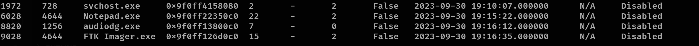
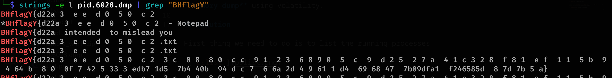

# unsupported - forensics

## Description

Straight forward challenge, the flag is written on running notepad process. Flag is direct without BHFlagY{} tag.

## Quick Overview

The goal of this challenge is to find what is written in **Notepad** from the given **memory dump** using Volatility.

## Solution

The first thing we need to do is list the running processes.

We can see **Notepad.exe** with **pid=6028**. This information is useful for dumping this process's memory and then searching for any interesting strings. Use `python3 /opt/volatility/vol.py -f memdump.mem windows.memmap --dump --pid 6028`.

After performing some searches, it seems that the content of **Notepad** is 16-bit little-endian encoded in the **memory map**, so we need to use this command: `strings -e l pid.6028.dmp | grep "BHflagY"`, where the option `-e l` is used for this purpose. We can see more interesting things here.

Remove **BHFlagY{}** and spaces from the data found, then submit the correct flag :))
